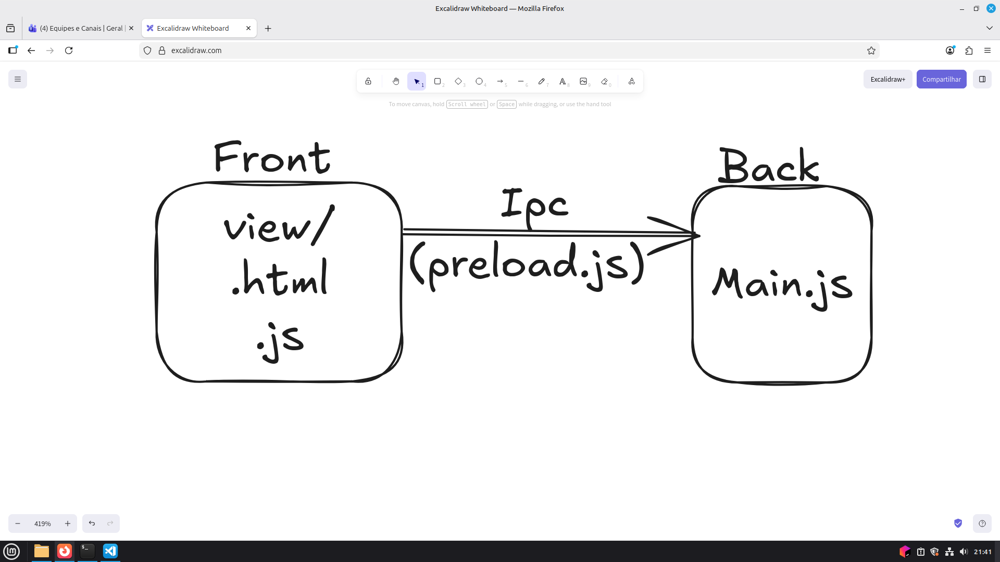

# Projeto Node.JS com Electron

## Passos iniciais

1. Criar o projeto no terminal `npm init -y hello-nodejs`
2. Instalar o Electron `npm i -D electron`
3. Instalar o SQLite3 `npm i sqlite3`
4. Iniciar o APP electron
4.1. No arquivo `main.js` criamos o createWindow() e app.whenReady() -> ponto inicial do APP
4.2. Configuração para executar o APP com node no arquivo `package.json` inserimos o comando `"start": "electron ."`
4.3. Rodar o APP com `npm run start`

## Configurar o SQLite

1. Criar o arquivo `./database/db.js` que é responsável por definir a estrutura do banco
2. Adicionar o comando `"db:create": "node database/db.js"` no `package.json`
3. Executar a criação de estrutura do banco com o comando `npm run db:create`

## Estrutura do Electron

O electron utiliza a seguinte estrutura:

O frontend fica na pasta `view/` contendo arquivos `html`, `css` e `js`, tudo que executa no navegador.

O arquivo `preload.js` faz o vínculo entre o frontend e as funcionalidades no backend.

O arquivo `main.js` fica responsável pelo ponto inicial do backend.